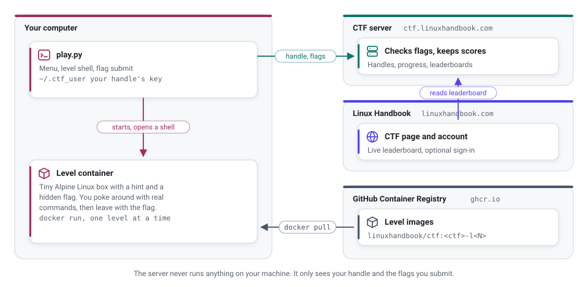

# Linux Handbook CTF

Capture-the-flag games you play in your terminal. No browser puzzles, no multiple choice. Just you, a shell and a flag hidden somewhere in a Linux system.

Each level drops you into a small Linux container with a hint. You use real commands to find the flag, submit it and move up the leaderboard. It's free, and you don't need an account to play.

The first game is Command Conqueror: 10 levels that start with hidden files and end with privilege escalation. More are on the way.

Leaderboard and details: [linuxhandbook.com/ctf](https://linuxhandbook.com/ctf/)

## How it works

<picture>
  <source media="(prefers-color-scheme: dark)" srcset="docs/how-it-works-dark.svg">
  
</picture>

The levels run on your own computer, inside Docker. That's why you get a real Linux system to poke at, and why it stays fast no matter how many people are playing.

The only things that leave your machine are your handle and the flags you submit. The server checks them and updates the leaderboard. It never runs anything on your computer.

## What you need

You need Linux or macOS with [Docker](https://docs.docker.com/engine/install/) installed and running. On Windows, play inside WSL 2.

You also need Python 3.7 or newer. It's already there on most Linux distributions and on macOS. The game uses nothing outside Python's standard library, so there's nothing to `pip install`.

## Start playing

Download the game and run it:

```bash
curl -fsSLO https://ctf.linuxhandbook.com/play.py
python3 play.py
```

If Docker needs root on your system, run `sudo python3 play.py` instead. Or add yourself to the `docker` group and skip `sudo` for good.

On the first run, you pick a handle. Then choose a game from the menu, type `play` to enter the level and start with `cat hint.txt`.

Flags look like `LHB{...}`. When you find one, type `exit` to leave the level and submit it:

```
submit LHB{...}
```

You can quit whenever you like. Run `python3 play.py` again later and you continue from the same level.

## Commands

| Command | What it does |
|---|---|
| `play` | Open a shell inside the level. Type `exit` to come back |
| `submit LHB{...}` | Submit the flag for this level |
| `leaderboard` | Top 10 for this game |
| `restart` | Throw the level away and start it fresh |
| `menu` | Back to the list of games |
| `quit` | Leave. Your progress is saved |

## Your handle, and why you might link an account

There's no sign-up. The first time you play, `play.py` creates a random key for your computer and saves it in `~/.ctf_user`. The server ties your handle to that key, so nobody else can play as you.

The catch is that the handle lives on that one computer. Lose the file, or switch to another machine, and you lose the handle.

If you have a free Linux Handbook account, you can fix that. Link your handle to it:

```bash
python3 play.py link
```

This opens a page on linuxhandbook.com with a short code. Sign in, check the code matches, confirm, and you're done. On any other computer, pick "sign in with my Linux Handbook account" on first run and you're back to your handle and progress.

Some future games may be only for Linux Handbook members. Linking is how you get into those. Command Conqueror is open to everyone.

## Command Conqueror

| Level | Points | You'll practise |
|:-:|:-:|---|
| 1 | 100 | Hidden files |
| 2 | 150 | Searching the filesystem |
| 3 | 200 | Awkward file names |
| 4 | 250 | Archives |
| 5 | 300 | Cron and encrypted archives |
| 6 | 350 | Processes and local network services |
| 7 | 400 | Process environments |
| 8 | 450 | Log filtering and text processing |
| 9 | 500 | Hard links and inodes |
| 10 | 600 | SUID and privilege escalation |

You play the levels in order, and each one gives its points once. The first few are friendly. By the end, you'll be chaining commands together and thinking like an attacker.

## Play fair

The flags live inside the containers on your computer. So yes, you could dig them out of the Docker images instead of solving anything. I can't stop you, but you'd be cheating yourself out of the fun part.

Please don't post flags or full solutions publicly either. Talking about approaches is fine.

## Privacy

The server stores your handle, a hash of your computer's key, which levels you solved and when. That's it.

If you link a Linux Handbook account, it also stores your member ID, so it can find your handle again, and whether your membership is paid. Your email and password never reach the CTF server. Linux Handbook vouches for you with a signed token, and the server checks the signature.

## Troubleshooting

**Docker is installed but not running.** Start it with `sudo systemctl start docker`, or open Docker Desktop on macOS.

**Permission denied from Docker.** Use `sudo python3 play.py`, or run `sudo usermod -aG docker $USER` and log in again.

**`CERTIFICATE_VERIFY_FAILED` on macOS.** Run *Install Certificates.command* from your Python folder in Applications.

**I want a fresh start.** Run `python3 play.py -r`. If your handle isn't linked to an account, this gives it up for good.

**Clean up afterwards.** Solved levels are removed automatically. To delete any leftovers, run `docker rmi $(docker images -q ghcr.io/linuxhandbook/ctf)`.

Stuck on a level that seems broken rather than hard? [Open an issue](https://github.com/linuxhandbook/ctf/issues) and tell me which level and what you saw.

## Credits

Command Conqueror was built for Linux Handbook by [Yash](https://github.com/Yash09042004). The CTF platform and this client are maintained by the Linux Handbook team.
